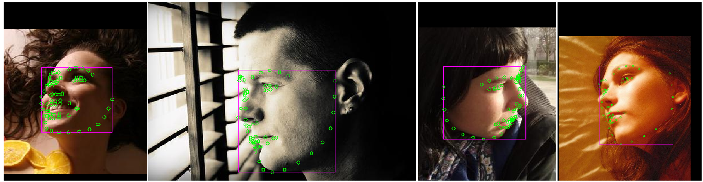
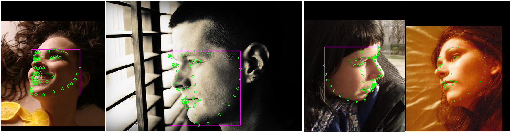

# RT

This is our repository of our paper (to be announced). 

Requirements : 
1. MTCNN requirements : https://github.com/DuinoDu/mtcnn
2. Tensorflow GPU : https://www.tensorflow.org/install/install_linux
3. Other package, can be installed by cloning my environment file on src : env.yml

<b> Landmark Tracker 
This main module used to do the tracking for both 2D and 3DA-2D facial landmark. To use : 
  
  python testRealtime.py
 
Also set the is3D in that file to True to have 3D points, False otherwise. Other configuration including filename of video can be set on the configuration.py file on src.

Example video : 

<b> Facial Localisation </b>
This module can be used independently to localise facial points from still image. To use : 

  python facial_localiser.py 
  
Set the is3D in that to be True/False and the filename on the configuration.py.

Some examples : 

2D Facial landmark : 

3DA-2D Facial landmark : 

python train.py

